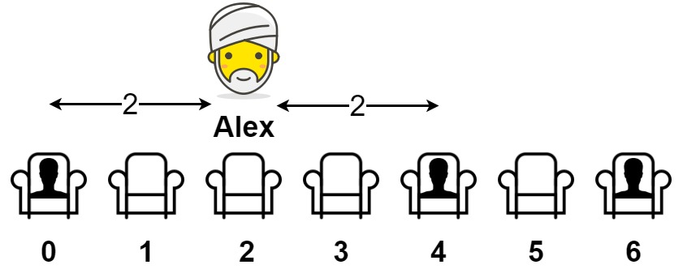

**849. Maximize Distance to Closest Person** - [Link to task](https://leetcode.ca/2016-08-09-253-Meeting-Rooms-II/);

**In** [table](https://github.com/hxu296/leetcode-company-wise-problems-2022) with tasks for company: 849, medium, [Yandex](https://github.com/hxu296/leetcode-company-wise-problems-2022?tab=readme-ov-file#yandex)

**Topic:** Array,
Weekly Contest 88

**Solve date**: --.07.2025

**Task:**
Вам предоставлен массив, представляющий ряд сидений, где seats[i] = 1 означает человека, сидящего на i-м месте, а seats[i] = 0 означает, что i-е место пусто (индексировано по 0).

Есть, по крайней мере, одно свободное место, и, по крайней мере, один человек сидит.

Алекс хочет сесть на такое место, чтобы расстояние между ним и ближайшим к нему человеком было максимальным. 

Верните это максимальное расстояние ближайшему человеку.

Input: seats = [1,0,0,0,1,0,1]
Output: 2
Explanation:
If Alex sits in the second open seat (i.e. seats[2]), then the closest person has distance 2.
If Alex sits in any other open seat, the closest person has distance 1.
Thus, the maximum distance to the closest person is 2.
Example 2:

Input: seats = [1,0,0,0]
Output: 3
Explanation:
If Alex sits in the last seat (i.e. seats[3]), the closest person is 3 seats away.
This is the maximum distance possible, so the answer is 3.
Example 3:

Input: seats = [0,1]
Output: 1
* 2 <= посадочных места.длина <= 2 * 10^4.
*   посадочных seats[i] равна 0 или 1.
*   Как минимум одно место свободно.
*   Как минимум одно место занято.